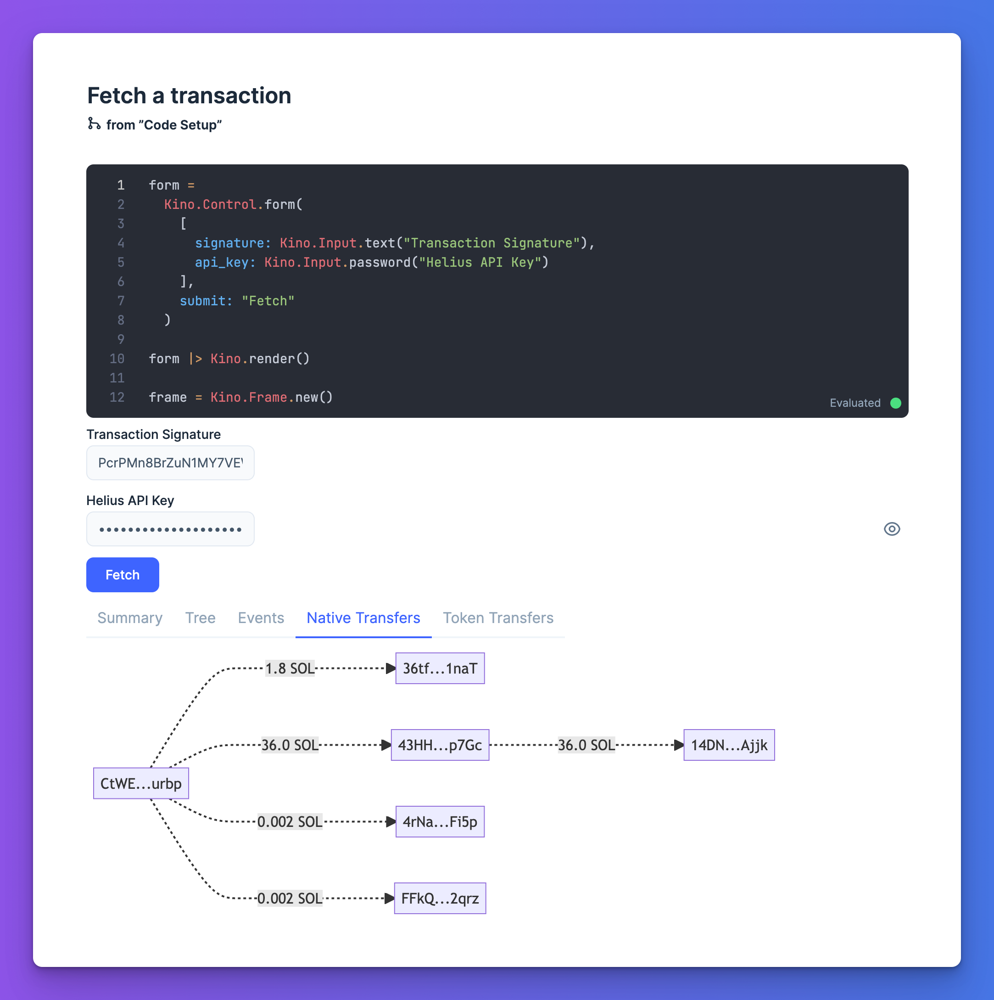
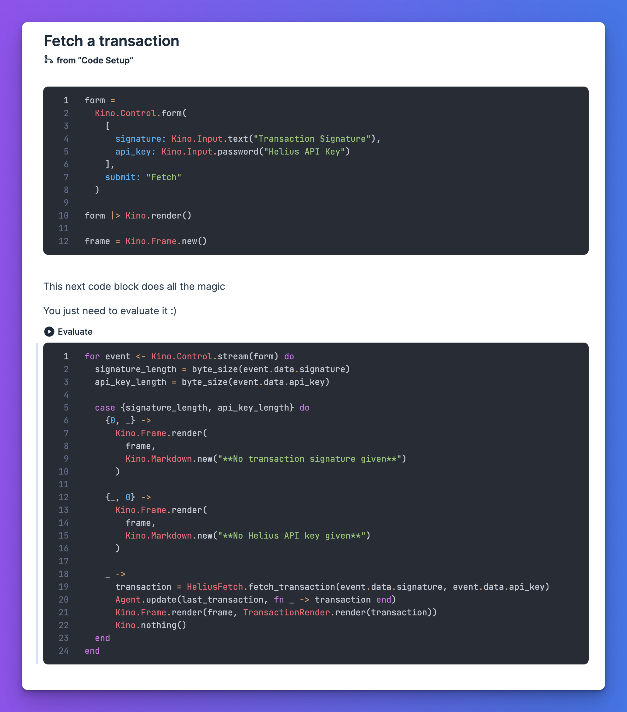

This repo includes an Elixir [Livebook](https://livebook.dev) to fetch and render a Solana transaction using the [Helius](https://helius.xyz) API

## To use

- Install Livebook or launch in the cloud: https://livebook.dev/#install
- Launch it and click import, import URL: https://github.com/mcintyre94/helius-livebook/blob/main/helius.livemd
- Either evaluate all (<kbd>ea</kbd>) or just evaluate the second cell in the Fetch a transaction section:

- This will render the form!
- Enter API key and transaction signature, hit Fetch
